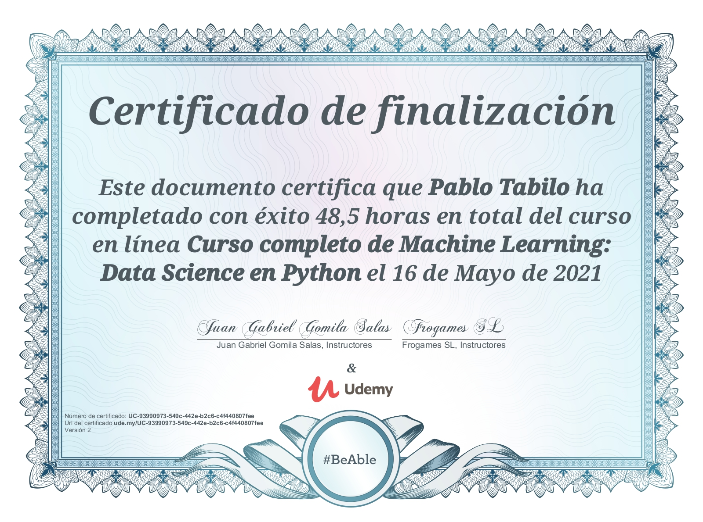

# Curso de Machine Learning : Data Science en Python
Curso completo de data science, todo el contenido se basa en el curso de [udemy](https://www.udemy.com/course/machinelearningpython/) ejercido por el profesor [Juan Gabriel](https://www.udemy.com/user/juangabriel2/)

# Notes
Apuntes del curso completo en [notion](https://www.notion.so/Curso-completo-ML-DS-con-python-a1dcc6e2d57c4f038240d3ac07444fea)

# Certificado

